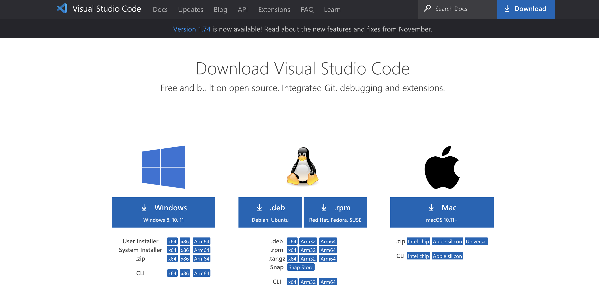
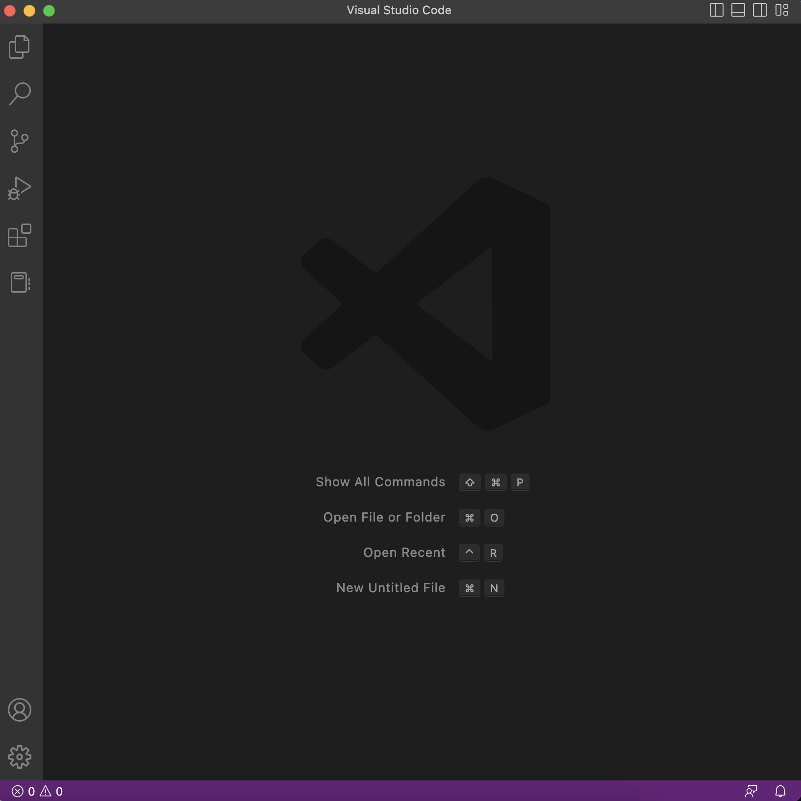
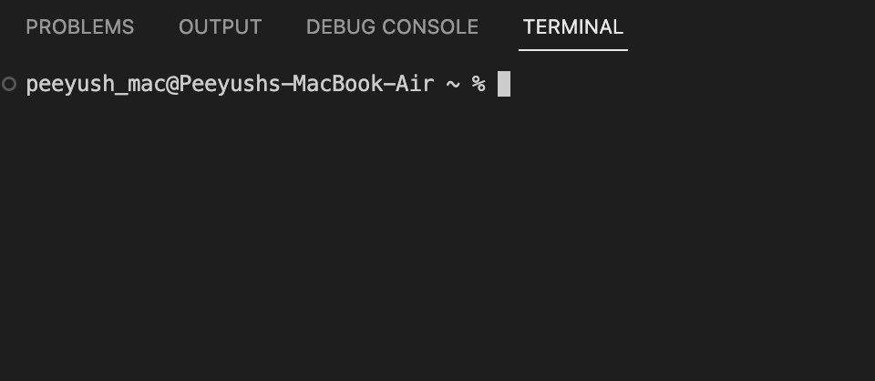
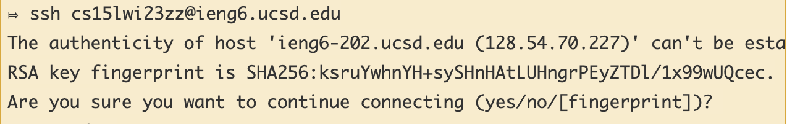
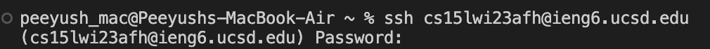
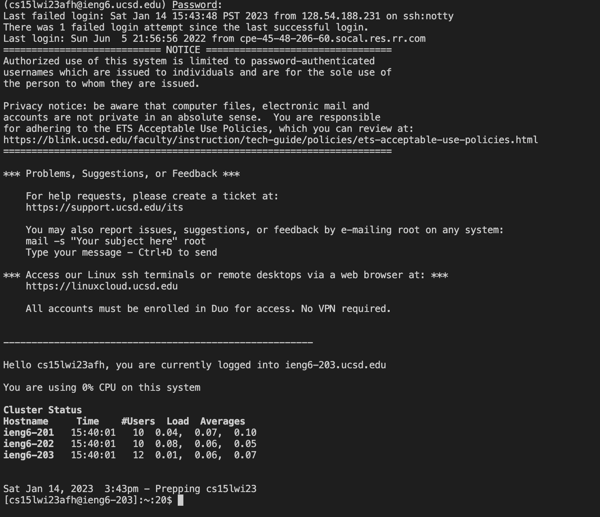
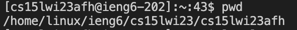
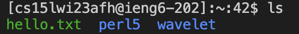
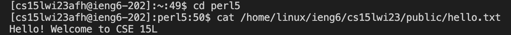
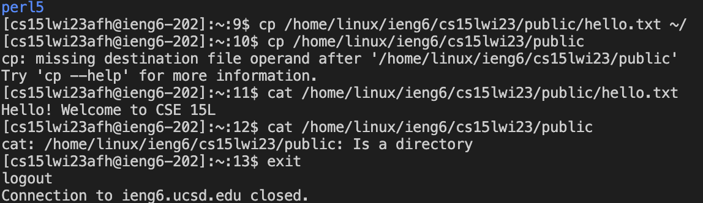

# Getting Started
Hello future CSE 15L Students. In this Lab we are going to learn how to do the following 3 things - 
* Installing VScode
* Remotely Connecting to a server in CSE Building
* Trying out some commands on terminal

Aren't you all excited !! So take out your laptops and let us begin- 

# Installing VScode 
---
First, we need to install an application where we would write our commands. The software we will be using for this purpose is VScode.
In order to download and install it, open a browser (like Chrome, Firefox etc.) and type the url *https://code.visualstudio.com/download*.
Now, figure out which OS you are using (Windows, Mac etc) and install VScode for that OS. We are good to go.

After installing VSCode, now open the application. The following window will appear on your screen.

# Remotely Connecting  
---
Second, install git. Since I use a Mac so I didn't need to install git externally on my laptop. Although, you can install git for windows by this [Link](https://gitforwindows.org/).
Then open the terminal on VScode. Your screen should look like the attached screenshot.

Then type the command *"ssh cs15lwi23zz@ieng6.ucsd.edu"*, replace *"zz"* by your course specific account's letters.
You will encounter a message if you are trying to log in for the first time to which you need to type in "yes" and press enter.
This should be the terminal message -

Then enter your password. 

You will not be able to see your typed-in password for security reasons. Nonetheless, your password is written there. Press enter again.
Now you will see the below displayed message which shows that your computer has been connected to the server. 

# Trying Some Commands 
---
Now try to play around with some commands. Try the following -

* pwd - It stands for present working directory. This command tells us the address of the directory we are currently working in.

* ls - ls stands for list. It is used to list out all the directories within your present working directory. 
* Extra Info: ls -a will list all the files and directories including all the hidden files

* cd - cd stands for change directory. It is used to change your present working directory.
* cat /home/linux/ieng6/cs15lwi23/public/hello.txt - cat stands for concatenate. This command reads and print the data from the file.

* cp /home/linux/ieng6/cs15lwi23/public/hello.txt ~/ - This command is used to copy the contents of a file

Here are some more use of these commands -

Hurray, we just learnt how to work with terminal. Now try to do it on your own without reading these instructions and make a github page of your own ! Ciao.
>In order to log out or disconnect from the remote server, run the command *"exit"* or press Ctrl+D.

