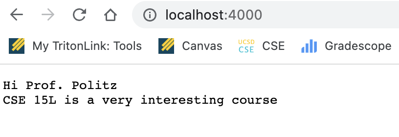

# Lab Report 2 : Servers and Bugs
---
Hello everyone!!
Today we are going to learn about a local web server and also learn debugging of computer programs. So let's begin 

# Part 1 : String Server

**Screenshot of code :**

Description of my code - In this code I have created a java file called StringServer whose purpose is to add messages (strings) to a variable calles str. We can use the path */add-messages* to add new lines of strings to our variable str.

**1st Screenshot of using /add-message :**

In the above screenshot we can see that the url of the webpage is *localhost:4000/add-message?s=Hi%20Prof.%20Politz*. First, my code implements method  url.getpath() and since the path in the above URL contains /add-message so the else statement block gets executed. The query in this url is */add-message?s=Hi%20Prof.%20Politz* Here, according to my code I split the query at "=" sign and since the parameter[0] is "s" so I concatenate parameters[1] which is "Hi Prof. Politz" along with "\n" (escape sequence for newline character) to the empty string called str. My program returns this string and that is what we see on the webpage.

**2nd Screenshot of using /add-message :**

In this second webpage screenshot we can see that the url of the webpage is *localhost:4000/add-message?s=CSE%2015L%20is%20a%20very%20interesting%20course*. Just like the previous case, first my code implements method url.getpath() and since the path in the above URL contains /add-message so the else statement block gets executed. The query in this url is */add-message?s=CSE%2015L%20is%20a%20very%20interesting%20course* Here, according to my code I split the query at "=" sign and since the parameter[0] is "s" so I concatenate parameters[1] which is "CSE 15L is a very interesting course" the variable str which already holds the value "Hi Prof. Politz". My program returns this complete string and that is what we see on the webpage.

**Main Webpage**

This is the server with the URL *localhost:4000/*. Here, as the path is just "/" so the if statement lock gets executed and it just returns the vlaue of the string str.
