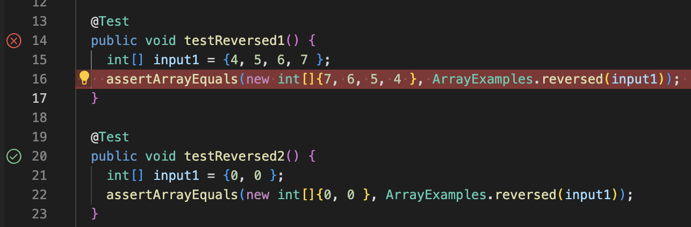

# Lab Report 2 : Servers and Bugs
---
# Part 1 : String Server

**Screenshot of code :**

 

Description of my code - In this code I have created a java file called StringServer whose purpose is to add messages (strings) to a variable calles str. We can use the path */add-messages* to add new lines of strings to our variable str.

**1st Screenshot of using /add-message :**

In the above screenshot we can see that the url of the webpage is *localhost:4000/add-message?s=Hi%20Prof.%20Politz*. First, my code implements method  url.getpath() and since the path in the above URL contains /add-message so the else statement block gets executed. The query in this url is */add-message?s=Hi%20Prof.%20Politz* Here, according to my code I split the query at "=" sign and since the parameter[0] is "s" so I concatenate parameters[1] which is "Hi Prof. Politz" along with "\n" (escape sequence for newline character) to the empty string called str. My program returns this string and that is what we see on the webpage.  

**2nd Screenshot of using /add-message :**

 

In this second webpage screenshot we can see that the url of the webpage is *localhost:4000/add-message?s=CSE%2015L%20is%20a%20very%20interesting%20course*. Just like the previous case, first my code implements method url.getpath() and since the path in the above URL contains /add-message so the else statement block gets executed. The query in this url is */add-message?s=CSE%2015L%20is%20a%20very%20interesting%20course* Here, according to my code I split the query at "=" sign and since the parameter[0] is "s" so I concatenate parameters[1] which is "CSE 15L is a very interesting course" the variable str which already holds the value "Hi Prof. Politz". My program returns this complete string and that is what we see on the webpage.

# Part 2 : BUGS

The bug I chose from lab 3 is in the method called "reversed" in the java file ArrayExamples.java  
A failure-inducing input for the buggy program, as a JUnit test - 

`@Test
public void testReversed1() {
    int [] input1 = {4, 5, 6, 7 };  
    assertArrayEquals (new int [] {7, 6, 5, 4 }, ArrayExamples. reversed (input1)) ;  
} `. 

An input that doesn’t induce a failure, as a JUnit test -  

`@Test
public void testReversed2() {
    int [] input2 = {0, 0 };  
    assertArrayEquals (new int [] {0, 0 }, ArrayExamples. reversed (input2)) ;  
} `. 

**The Symptoms**

In the above Junit tests we can see clearly that the first test failed but the second test passed which implies there is a bug in this method and this output is its symptom.

**SOLUTION**

**Before** 

`static int[] reversed(int[] arr) {
    int[] newArray = new int[arr.length];
    for(int i = 0; i < arr.length; i += 1) {
      arr[i] = newArray[arr.length - i - 1];
    }
    return arr;
 }`

In order to fix this bug we need to write the following code -  

**After**

`static int[] reversed(int[] arr) {
    int[] newArray = new int[arr.length];
    for(int i = 0; i < arr.length; i += 1) {
      newArray[arr.length - i - 1] = arr[i] ;
    }
    return newArray;
 }`
 
This fix addresses the issue because in the initial code we were changing/reeplacing the elements in the array "arr" with the elements from the "newArray" but newArray is already empty (that is, all values in it are set to 0 by default). So the old code was just repalacing all the elements in arr with 0.  
But in the updated code we are replacing the values in newArray with the values from arr index-by-index and in the reverse order. Once all the elements are reversed, we return the newArray as this is the reversed version of our main array "arr".

# Learning Outcome

I learned many new and exciting things in the previous two labs. One of the best things I learned was making a web server as I have always wondered about how these webpages are created. I was fascinated after making my own website. 

Thank you for giving your time to read this article.

  

