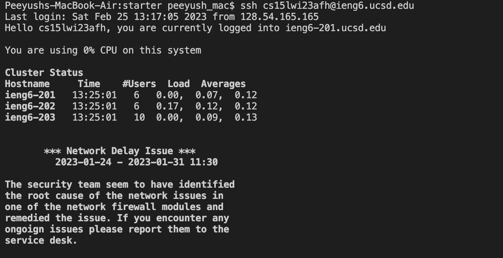
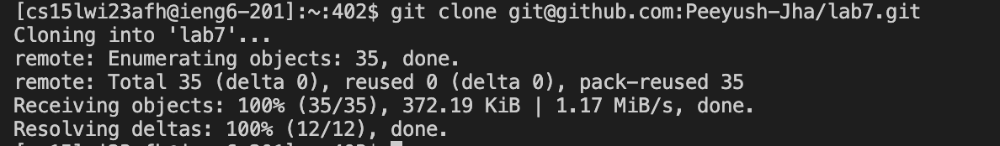
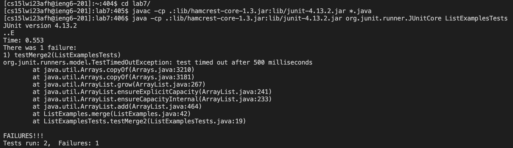
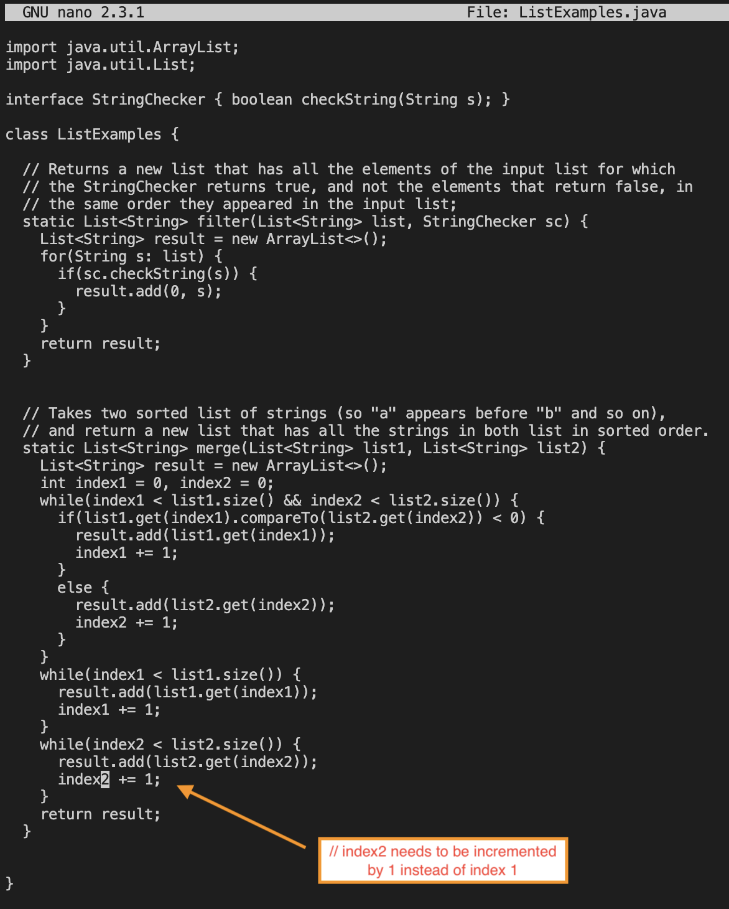
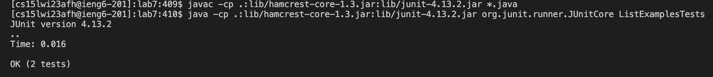
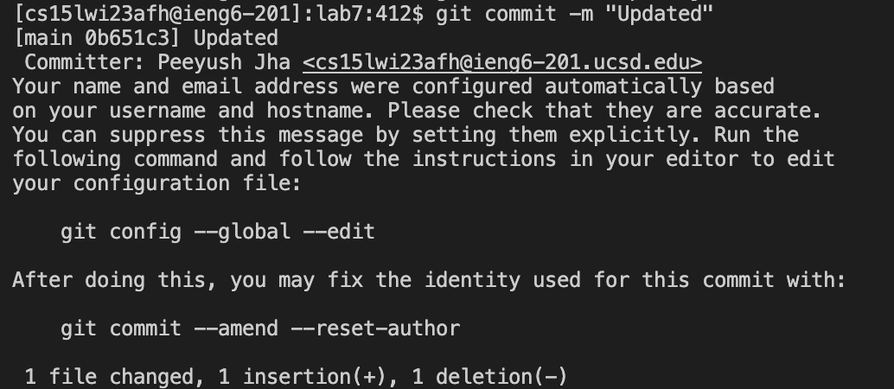
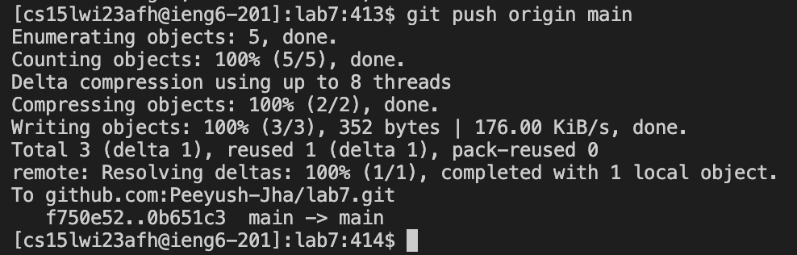

# LAB REPORT 4
## Getting fast at Terminal Commands

**Step 4 : Log into ieng6** 

I used `Ctrl-R` to reverse-i-search for `ssh cs15lwi23xxx@ieng6.ucsd.edu` command by searching for the keyword "ssh".  

*Keys Pressed : `<Ctrl-R> ssh <enter>`*

This command helped me access the remote server of ieng6 on my local computer. Now I have access to the specific  cs15lwi23xxx@ieng6.ucsd.edu account from my personal device.

 

---

**Step 5 : Clone your fork of the repository from your Github account** 

The `git clone git@github.com:Peeyush-Jha/lab7.git` command was 6 up in the search history, so I used up arrow to access and run it. 

*Keys pressed: `<up><up><up><up><up><up><enter>`*

This command cloned the fork of the repository from my Github account. In other words, it made a copy of the fork and stored it in my ieng6 account.

---

**Step 6 : Run the tests, demonstrating that they fail**

Fist I changed my directory to `lab7/`. Then I used `Ctrl-R` to reverse-i-search for `javac -cp .:lib/hamcrest-core-1.3.jar:lib/junit-4.13.2.jar *.java` command by searching for the keyword "javac".   
Afterwards, I again used `Ctrl-R` to search for `java -cp .:lib/hamcrest-core-1.3.jar:lib/junit-4.13.2.jar org.junit.runner.JUnitCore ListExamplesTests` with the help of the keyword "java".  

*Keys Pressed : `cd l<tab> <enter>` , `<Ctrl-R> javac <enter>`, `<Ctrl-R> java <enter>`.*

These commands compiled and ran the file `ListExampleTests`. The output shows us that 1 of the 2 test failed.

---

**Step 7 : Edit the code file to fix the failing test**

In order to access the content of the file from terminal I used `nano ListExamples.java`. Then I fixed the code by changing `index1` to `index2` on line 43 and saved the edited code by using `Ctrl-O`. In order to exit the "nano" interface I used `Ctrl-X`.

*Keys Pressed : `nano L<Tab> .j<tab> <enter>` , `<Ctrl-O> <enter> <Ctrl-X>`*

I made this change in code because index2 needs to be incremented by 1 instead of index1 in the last while loop to get the desired result.

---

**Step 8 : Run the tests, demonstrating that they now succeed**

The `javac -cp .:lib/hamcrest-core-1.3.jar:lib/junit-4.13.2.jar *.java` command was 3 up in the search history, so I used up arrow to access it. Then the
`java -cp .:lib/hamcrest-core-1.3.jar:lib/junit-4.13.2.jar org.junit.runner.JUnitCore ListExamplesTests` command was 3 up in the history, so I accessed and ran it in the same way.

*Keys pressed: `<up><up><up><enter>`, `<up><up><up><enter>`*

These commands re-compiled and re-ran the updtaed file `ListExampleTests`. The output shows us that both of the tests passed this time.
  
 

  
---

**Step 9 : Commit and push the resulting change to your Github account**
  
For the last part, we need to use 3 git commands - `git add <FileName>` , `git commit -m <message>` and `git push origin main`. Since my terminal history already had these commands saves so I used `Ctrl-R` to search for them.    

*Keys Pressed : `<Ctrl-R> add <enter>` , `<Ctrl-R> commit <enter>` , `<Ctrl-R> push <enter>`*
 
*`git add` - This command added (overwrote) the `ListExamples.java` file in the directory.  

*`git commit` - This command recorded the changes on my local "cloned" repository.  

*`git push` - This command sent the committed changes to the remote repository and updated it.
  

---

That is the end for Lab Report 4. Thanks for reading it.

