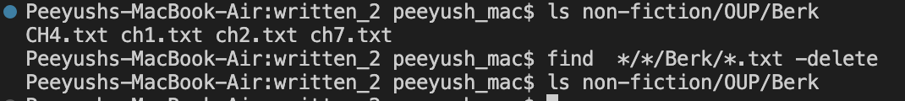

# LAB REPORT 5

## Re-do for Lab Report 3
I have chosen `find` command for this lab report. (Earlier I had done `grep` in Lab Report 3) Therefore, in the following report I will give 3 interesting command-line options to use `find`. I will be writing the commands inside the `/written_2` directory. This means `/Users/Documents/GitHub/docsearch/written_2` will be my present working directory.
   
**1) `-delete` option -**
If we want to delete a file or directory we can use the `-delete` command- line option.

* Example - 

```
find  */*/Berk/*.txt -delete
```

Output of Example -





Here, we can see that this command deleted all the files inside Berk recursively as after calling `-delete` and then `ls` I found no files.

I found this option by using the command man find on terminal.

**2) `-name` option -**
This command is used to search for files and directories that match a specific pattern or name. We don't need to provide the address of the directory in this option as it automatically searches within each subdirectory until it finds the names that matches the argument.

* Example - 

```
find . -name "ch5.txt"
```

Output of Example -

```
./non-fiction/OUP/Kauffman/ch5.txt
./non-fiction/OUP/Fletcher/ch5.txt
```

Here, only two files inside written_2 directory contained "ch5.txt" and `find -name` gave us those required files.

I found this option by using the command man find on terminal.

---

That was it for Lab Report 5. Thanks a lot for reading this page !!!
